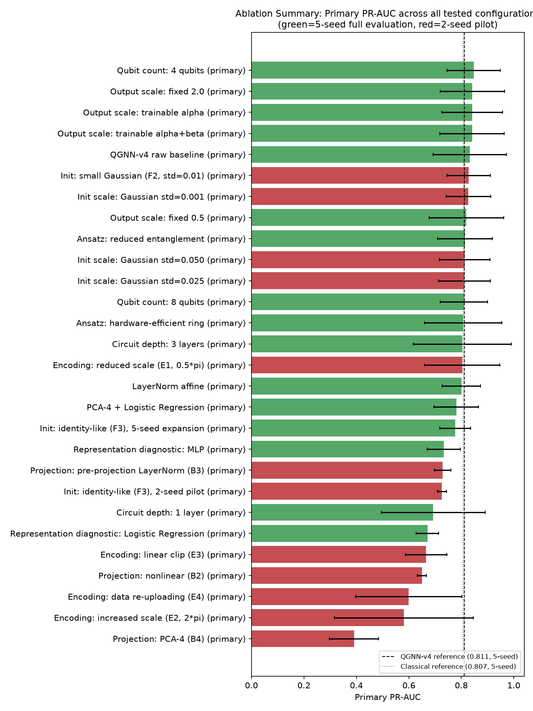

# QGNN-v4: A Comparative Study of Classical and Quantum Graph Neural Networks for Supply Chain Disruption Prediction

*Working draft. Citation keys in brackets refer to `MSE_Phase1/TemplatePPT/refs.bib`. Two keys used in an earlier draft of this section — "Ju" and "Jahin" — are not backed by any entry in that file and have been dropped here rather than left unverifiable; see the note at the end of this document.*

---

## 1. Introduction

Modern supply chains are large, densely interconnected systems in which a
disruption at a single supplier can propagate through procurement,
production, and distribution relationships to affect plants, products, and
regions several hops away. Predicting *where* and *when* such disruptions
will occur is therefore not a per-entity classification problem but a
relational one: a supplier's risk depends on the state of its neighbors,
its neighbors' neighbors, and the structure connecting them. This relational
character has made graph neural networks (GNNs) a natural fit for
supply-chain risk modeling, and a growing body of work has applied them to
exactly this setting. Wu et al. use GNNs to recover supply chain network
structure from operational data [wu2025]; Liu et al. model complex
dependency propagation in global supply chain networks with graph learning
[liu2026]; Ziaria et al. propose an intelligent analytics framework for
supplier selection and delay-risk management in sustainable supply chains
[ziaria2026]; Larbi et al. combine dual machine learning models for IoT-based
quality and supply chain management [larbi2025]; and Yadav's survey
situates graph convolutional and graph attention approaches specifically
within supply chain risk propagation [yadav2021]. Across this literature,
GraphSAGE-style neighborhood-aggregation architectures are a recurring
choice precisely because supply chain graphs are large, heterogeneous
(suppliers, materials, plants, products, regions), and require inductive
generalization to entities not seen during training.

In parallel, quantum machine learning has been explored as an alternative
computational substrate for graph- and risk-related prediction tasks,
though almost entirely outside the supply-chain domain itself. Soni et al.
survey quantum computing applications for supply chain management and
logistics at a conceptual level [soni2024], and Phillipson provides a
broader overview of quantum computing in logistics and supply chain
management [phillipson2024], but neither reports an end-to-end trained
quantum model on a supply-chain benchmark. Concrete hybrid quantum-classical
architectures are more developed in the adjacent domain of financial risk
and fraud detection: Innan et al. introduce a quantum graph neural network
for financial fraud detection [innan2024] and a quantum federated neural
network variant [innan2025], while El Alami et al. compare quantum machine
learning architectures against classical baselines for credit card fraud
detection [el2026]. Lamichhane and Rawat's survey of quantum machine
learning more broadly documents the recurring pattern in this literature:
small variational quantum circuits are typically attached downstream of a
classical feature extractor rather than replacing it end-to-end
[lamichhane2025].

This paper sits at the intersection of these two lines of work. We take the
GraphSAGE-based classical GNN approach established for supply chain risk
prediction [wu2025, liu2026, yadav2021] as our baseline, and construct a
hybrid quantum-classical counterpart — a small variational quantum circuit
reading a frozen, classically-learned GraphSAGE embedding — following the
hybrid design pattern used for fraud and risk detection in
[innan2024, innan2025, el2026]. Rather than searching for a single
highest-scoring configuration, our objective is to determine, under a
controlled and reproducible experimental protocol, whether the quantum head
matches, exceeds, or falls short of the classical baseline on supplier
disruption prediction, and — more importantly — which architectural and
training factors actually govern the hybrid model's behavior. The
comparison is carried out on a purpose-built synthetic supply-chain
benchmark (Section 3) designed specifically to support this kind of
classical-vs-quantum evaluation without the label-leakage and
data-availability problems that real, proprietary supply-chain data would
introduce.

## 2. Methodology

The complete methodology — architecture specification, training protocol,
hyperparameters, and the full nine-phase experimental design — is
documented in `QGNN_V4_Final_Research_Report.docx` (Sections 2–12,
pp. 7–28) and is not repeated in full here. In summary:

- **Classical baseline**: `HeteroGraphSAGE` — a type-specific input
  projection followed by two layers of mean-aggregation `SAGEConv`
  (via PyTorch Geometric's `HeteroConv`) over the heterogeneous supply
  chain graph, a supplier-node readout, and an `MLP(128→64→1)` classifier
  head. Hidden dimension 128, trained end-to-end.
- **Hybrid quantum head (QGNN-v4)**: the same GraphSAGE encoder, frozen
  after training, feeding a `Linear(128,6) → π·tanh → AngleEmbedding(RY) →
  StronglyEntanglingLayers (6 qubits, 2 layers) → PauliZ(6) →
  LayerNorm(6, no affine) → Linear(6,1)` head, implemented as a
  `qml.qnn.TorchLayer` and simulated on PennyLane's `default.qubit`
  (exact, noise-free, `diff_method="backprop"`).
- **Training protocol**: Adam (lr = 0.001, weight decay = 0.0001), up to
  100 epochs with early stopping (patience 10), balanced class weighting,
  and a fixed 0.5 decision threshold — identical across every configuration
  compared.
- **Evaluation**: PR-AUC as the primary metric (justified in Section 4.3),
  alongside ROC-AUC, F1, precision, recall, specificity, balanced accuracy,
  MCC, Brier score, and ECE, computed through one shared metrics
  implementation for every model.

## 3. Dataset Construction

Evaluating a classical-vs-quantum comparison fairly requires a benchmark
where disruption labels are known to be *caused* by simulated mechanisms
rather than incidentally correlated with easily-memorized features — a
guarantee real supply-chain data cannot offer without extensive, often
impossible, causal auditing. For this reason the benchmark used throughout
this work, `scm_v1_black_swan_seed43`, is a fully synthetic,
generator-produced supply chain, built with a dedicated dataset framework
(`SCM_DATASET_GENERATION_PLAN.md`) rather than sourced from a single
real-world company.

**Graph.** The benchmark graph has 2,670 nodes across six typed entities —
300 suppliers, 100 materials, 50 plants, 200 products, 20 regions, and
2,000 procurement-order nodes — connected by 7,675 directed edges across
nine relation types (e.g. supplier→material, plant→product,
procurement-order→supplier). The graph is sparse (density 0.00215),
long-tailed in degree (mean 5.75, median 3.0, max 136), and fully connected
in one component with an average shortest path length of 3.82. Supplier
degree correlates only weakly with disruption rate (Pearson r = 0.054),
confirming that disruption labels are not a trivial function of graph
structure alone.

**Simulation.** On top of this static topology, a discrete-time simulation
(weekly periods, 104 periods total — roughly two years) models demand,
production, inventory, and procurement under realistic operational
constraints: bounded production capacity, no negative inventory,
lead-time-gated delivery, and capacity-limited suppliers. A separate
black-swan event engine injects five categories of disruption (supplier
failure, natural disaster, geopolitical disruption, cyberattack, logistics
disruption) at a graded 1–5 severity scale, each affecting capacity,
lead time, duration, and recovery differently, and each propagating through
the existing simulation constraints rather than through hand-coded cascade
rules — so a shortage at one supplier organically reduces downstream
material availability, production, and fulfillment without any
disruption-specific logic being added at the label stage.

**Labels and target.** The prediction target, `supplier_disrupted`, is a
4-period-ahead binary label derived from the simulated operational time
series (never copied from static input risk attributes), giving an overall
supplier-period disruption rate of 3.33% — a realistically rare-event,
imbalanced target. Three additional label families (material shortage,
production loss, product shortage/revenue impact) are exported alongside
it but are not the focus of this comparison.

**Splits.** The benchmark defines two evaluation conditions from the same
underlying graph and simulation run: a **primary (temporal) split** — a
70/15/15 train/validation/test partition over disjoint period ranges, with
no random shuffling of the simulated trajectory — and a **severity split**,
which trains on severity ≤3 periods and tests on severity 4–5, designed to
probe out-of-distribution generalization to more extreme disruptions. A
feature audit accompanying the benchmark explicitly marks which exported
columns are legitimate model inputs (static graph attributes, realized
operational observations) versus disallowed ones (event records, cascade
summaries, and the label tables themselves), preventing the kind of label
leakage that is a known risk in supply-chain and fraud-style benchmarks
built from simulated or historical event logs.

## 4. Research and Development

### 4.1 Experimentation Setup

All experiments were run under one shared codebase and metrics
implementation to keep the classical and quantum models directly
comparable. The classical `HeteroGraphSAGE` encoder was trained once,
end-to-end, and then frozen; every downstream head (the classical MLP head
used for the reference score, and every QGNN-v4 configuration) was trained
on top of the identical frozen 128-dimensional supplier embedding, so that
differences in downstream performance could be attributed to the head
architecture rather than to differences in the upstream representation.
Every configuration used the same optimizer, learning rate, weight decay,
early-stopping patience, class-balancing strategy, and fixed 0.5 decision
threshold (Section 2). Each reported configuration was evaluated across
5 independent random seeds, with mean ± standard deviation reported
throughout, rather than a single best run — a design choice made
specifically because seed sensitivity turned out to be a dominant effect
in this system (see Section 4.4).

Technology stack: Python 3.12.3, PyTorch 2.14.0, PyTorch Geometric
(`HeteroConv`, `SAGEConv`) for the classical encoder, and PennyLane 0.45.1
(`qml.qnn.TorchLayer`, `default.qubit`, `backprop` differentiation) for the
quantum head. All computation was run on CPU, in an ideal, noise-free
simulator — no physical quantum hardware was used, and no claim of quantum
computational advantage is made.

**Controlled variation.** Rather than accept a single headline comparison,
the QGNN head's own design was varied one factor at a time against fixed
controls — architecture family, optimizer, and threshold policy held
constant throughout. Six factors were investigated: qubit count (4/6/8,
Phase 3, 5 seeds each), circuit depth (1/2/3 variational layers, Phase 3,
5 seeds at 1 layer), entanglement ansatz (StronglyEntangling/
hardware-efficient ring/reduced-entanglement chain, matched at 6 qubits/2
layers, Phase 4 Stage 5, 5 seeds each), projection architecture (linear/
nonlinear/pre-norm/PCA-informed, Phase 4 Stage 2, 2-seed pilot), quantum
parameter initialization (default/small-Gaussian/identity-like, later a
5-point Gaussian-std sweep, Phase 4 Stages 4 and 4b, 2-seed pilots with a
5-seed expansion for identity-like only), and angle-encoding scheme (scale,
clip-vs-tanh, data re-uploading, Encoding Investigation, 2-seed pilot). Each
phase changed exactly one factor while holding every other setting fixed,
so any effect observed could be attributed to that factor specifically —
though seed count itself varied by design, following this project's own
pilot-then-expand staging rather than a uniform 5-seed standard across
every factor (`QGNN_V4_FINAL_RESEARCH_SUMMARY.md` §18 flags which pilot
findings were never confirmed at full scale). This mirrors the
feature-map/ansatz sensitivity analysis reported for QGNN-based fraud
detection, where classifier performance is likewise systematically probed
across encoding and ansatz configurations rather than reported as a single
score \cite{QCinFraudDetection}.

**Table 2 — The six ablated factors, primary (temporal) split only**

| Factor | Configuration | Seeds | Primary PR-AUC | Outcome |
|---|---|---:|---:|---|
| *(reference)* | Classical GraphSAGE-Full | 5 | 0.807 ± 0.066 | Baseline |
| *(reference)* | QGNN-v4 standing reference | 5 | 0.811 ± 0.074 | Baseline |
| Qubit count | 4 qubits | 5 | 0.847 ± 0.102 | Highest nominal mean, but variance ~40% higher than reference — not confirmed robust |
| Qubit count | 8 qubits | 5 | 0.810 | Within noise of reference |
| Circuit depth | 1 layer | 5 | 0.693 | Substantially worse — dropped |
| Circuit depth | 3 layers | 0 (run killed) | — | Run failed mid-batch, zero usable data — not evidence either way |
| Ansatz | Hardware-efficient ring | 5 | 0.807 | Within noise of reference |
| Ansatz | Reduced entanglement | 5 | 0.814 | Within noise of reference |
| Projection | Nonlinear / pre-norm / PCA-informed | 2 (pilot) | 0.391–0.729 | All underperformed — dropped, never expanded to 5 seeds |
| Initialization | Small-Gaussian / identity-like | 2 (pilot) | 0.726–0.828 | Nominal gain, not confirmed |
| Initialization | Identity-like, 5-seed expansion | 5 | 0.777 ± 0.059 | Earlier stability claim did not replicate — dropped |
| Encoding | Scale / clip / re-uploading | 2 (pilot) | 0.581–0.803 | No seed-consistent improvement — dropped, never expanded |

*Source: `QGNN_V4_MASTER_RESULTS.csv`, primary-split rows only; severity
columns omitted per this paper's scope.*

### 4.2 Dataset and Benchmarking

As described in Section 3, all experiments use the `scm_v1_black_swan_seed43`
benchmark, evaluated here on its **primary (temporal) split**: a 70/15/15
train/validation/test partition over disjoint 104-period ranges, with the
`supplier_disrupted` 4-period-ahead target (3.33% base rate). Restricting
this comparison to the primary split keeps the evaluation condition
in-distribution and temporally realistic — training on earlier periods and
testing on strictly later ones — and isolates the question this section
addresses (does the quantum head match the classical baseline under
standard generalization?) from the separate, harder question of
out-of-distribution severity generalization, which is treated independently
in the full research report rather than in this comparison.

### 4.3 Performance Metrics

PR-AUC is used as the primary metric rather than accuracy, for a specific
reason grounded in this dataset: with a 3.33% positive rate, a
constant-negative predictor already scores roughly 97% accuracy, making
accuracy uninformative for this task. PR-AUC, unlike ROC-AUC, is
specifically sensitive to performance on the minority (disruption) class,
and, unlike F1/precision/recall, is threshold-independent — avoiding a
documented artifact in this project where a poorly-calibrated model's
threshold-based metrics can look better or worse purely from where its
probability distribution sits relative to the fixed 0.5 cutoff, independent
of true ranking quality. ROC-AUC, F1, precision, recall, specificity,
balanced accuracy, MCC, Brier score, and ECE (expected calibration error)
are reported alongside it for a complete picture.

**Table 1 — Primary (temporal) split, 5-seed mean ± std**

| Metric | Classical GraphSAGE-Full | QGNN-v4 |
|---|---:|---:|
| PR-AUC | 0.807 ± 0.066 | 0.811 ± 0.074 |
| ROC-AUC | 0.987 | 0.978 |
| F1 | 0.677 | 0.657 |
| Precision | 0.522 | 0.519 |
| Recall | 0.968 | 0.898 |
| Specificity | 0.935 | 0.940 |
| Balanced accuracy | 0.952 | 0.919 |
| MCC | 0.685 | 0.654 |
| Brier score | 0.042 | 0.066 |
| ECE | 0.049 | 0.182 |

*Source: `QGNN_V4_MASTER_RESULTS.csv` (Reference rows, primary split);
`QGNN_V4_CLASSICAL_BASELINE.md`; `QGNN_V4_PHASE2C_REPORT.md`.*

### 4.4 Results and Analysis

*Figure 2 — Primary PR-AUC for every configuration in Table 2, plotted
against the QGNN-v4 and classical references (dashed/dotted lines). Source:
`final_figures/fig2_ablation_primary_pr_auc.png`, built directly from
`QGNN_V4_MASTER_RESULTS.csv`.*

On the primary (temporal) split, the two models are statistically close on
ranking quality: PR-AUC of 0.807 ± 0.066 (classical) vs. 0.811 ± 0.074
(QGNN-v4) — a difference well within each model's own seed-to-seed noise,
and QGNN-v4 is nominally, if not meaningfully, ahead. This is the headline
result of the primary-split comparison: on standard, in-distribution
temporal generalization, the hybrid quantum-classical head performs
essentially on par with the fully classical baseline.

The two models diverge, however, on two secondary properties:

1. **Recall and balanced accuracy.** The classical model recovers more of
   the true disruption cases (recall 0.968 vs. 0.898) and has higher
   balanced accuracy (0.952 vs. 0.919), indicating it is somewhat more
   conservative — willing to flag more borderline cases as at-risk — at a
   comparable precision to the quantum head (0.522 vs. 0.519).
2. **Calibration.** The classical model is substantially better calibrated:
   ECE of 0.049 versus 0.182 for QGNN-v4 — roughly a 3.7× difference — and a
   correspondingly lower Brier score (0.042 vs. 0.066). This means that
   when the classical model outputs a probability of, say, 0.7, that
   probability is considerably more trustworthy as an actual likelihood of
   disruption than the equivalent QGNN-v4 output, even though the two
   models rank cases almost equally well by PR-AUC.

A further methodological finding from the underlying experimental program
(nine controlled phases, ~230 training runs total; see
`docs/results/QGNN_V4_FINAL_RESEARCH_SUMMARY.md` for the full account) is
that no tested architectural variation of the quantum head — output
scaling, LayerNorm normalization, qubit count, circuit depth, projection
architecture, parameter initialization, ansatz topology, or encoding
scale — produced a reproducible, seed-robust improvement over the standing
QGNN-v4 configuration reported in Table 1. LayerNorm was adopted as the
standing reference specifically because it reduced seed-to-seed variance
and improved calibration relative to a raw (un-normalized) baseline, not
because any configuration closed a performance gap to classical — on the
primary split, there was effectively no gap to close.

**Summary.** On temporal (primary) generalization, the hybrid QGNN-v4
architecture matches the classical GraphSAGE-Full baseline on ranking
quality (PR-AUC) but trails it on calibration and recall. This positions
the quantum head, within the scope of this ideal-simulator, single-dataset
comparison, as a viable but not yet superior alternative to the classical
approach for this task under standard evaluation conditions.

## 5. Conclusion

This study compared a classical GraphSAGE-based GNN against a hybrid
quantum-classical head (QGNN-v4) for supplier disruption prediction on a
purpose-built synthetic supply-chain benchmark, under a shared,
seed-controlled experimental protocol. On the primary (temporal)
generalization condition, the two approaches perform comparably on ranking
quality (PR-AUC 0.807 vs. 0.811), with the classical model retaining an
advantage in recall and, more substantially, in probability calibration.
No architectural modification to the quantum head — across projection,
initialization, ansatz, encoding, qubit count, or depth — produced a
reproducible improvement over the standing QGNN-v4 configuration, situating
this result as a stable characterization of the current architecture family
rather than a single best-effort score. These findings are scoped to the
specific dataset, frozen classical encoder, and ideal noise-free quantum
simulator used throughout; they do not constitute a general claim about
quantum versus classical graph learning, about behavior on physical quantum
hardware, or about performance on real-world supply-chain data. Within
those bounds, the evidence supports treating the hybrid quantum-classical
head as a competitive — though not yet clearly superior — alternative to
a classical GNN for this class of relational risk-prediction task, with
calibration rather than ranking quality identified as the more actionable
direction for further architectural work.

---

### Notes for the author

- **Unverified citations dropped.** The earlier session's intro referenced
  "Ju" and "Jahin" as classical-GNN supply-chain citations. Neither has a
  matching entry in `MSE_Phase1/TemplatePPT/refs.bib` or anywhere else in
  the repository, so they were not reused here — reusing them would have
  meant citing sources with no verifiable bibliographic details. If you
  have the actual papers in mind, send the title/author/venue and I'll add
  proper `@article`/`@inproceedings` entries to `refs.bib` and cite them
  correctly.
- **`yadav2021` is itself an incomplete bib entry** (title marked "full
  title to be added", no venue) — it's usable as a placeholder but should
  be completed before this goes into a final submission.
- **GraphSAGE's original citation** (Hamilton, Ying & Leskovec, 2017) is
  not currently in `refs.bib` either; Section 2 references "the GraphSAGE
  framework" generically. Let me know if you want that added as a formal
  citation.
- The architecture diagram (matplotlib house-style, matching the report's
  actual figures, no internal codenames) is still outstanding — this
  session did not yet rebuild it. Say the word and I'll pull the figure
  style from the report's embedded images and produce it.
